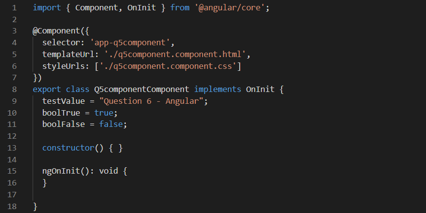
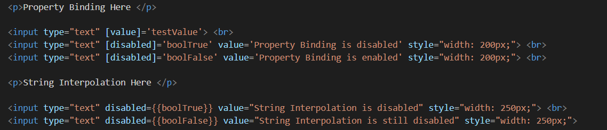
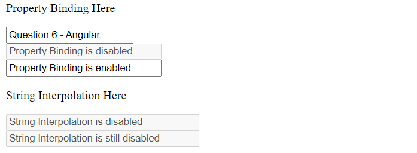

## Angular

1. **I understand the structure of an Angular application**

    
    
    An Angular application is made up of a series of files and folders.  
    I would like to talk about the following:  
    - _src/_ : Folder contains the components and services that will make up the UI and fetch data to be displayed in the case where we need to get it from an external source.  
    - _README.md_: Readme file that contains commands on how to run and test the Angular application.  
    - _node\_modules_: Folder that contains the required node modules needed to build the application.    

2. **I understand what a Single Page Application is**

    This is when a website does not go back and forth to the server anytime a user requests for information.
    There are no frequent reloads to the website as the request for information done behind the scene and only parts of the website that have new information are updated and not the whole page.  

3. **I can create a new Angular application using Angular CLI**

    3.1 ``ng new ttAngular``  
    

    The command above is used to create a new Angular application by name _ttAngular_

4. **I can build and serve an Angular application using Angular CLI**  

    4.1 ``ng build``  
      

    This command builds the application into the **dist** folder.  
    Any changes made to the code after does not cause any change to the dist folder unless the ``ng build`` command is run again.

    4.2 ``ng serve``  
      

    It starts your web browser and your application is available on the specified port (4200 by default).  
    Any changes made in the code causes the application to be built again.

5. **I understand the structure of an Angular component**  

    The idea behind a component is creating a custom browser tag and adding functionality that says what it does.  
    A component is made up of a decorator ``@Component`` and a class both which are defined in a **nameOfComponent.component.ts** file.  

6. **I can create components using Angular CLI**  

    6.1 ``ng generate component q5component``  
      

    The command creates a component.  
    A folder **q5component** is created under the **src/app** folder.  

7. **I can use Property Binding to control the state of a button**  

    In property binding, we need an HTML property, in our example **input's value property**.  
    We surround it with the square brackets _[  ]_ and assign its value to a property we have defined in out ts file _boolTrue/boolFalse_
    
    7.1 _Inside component's ts file_  
       

    7.2 _Inside component's html file_  
      

    7.3 _In the web browser_  
      

8. **I can use Event Binding to invoke a function when a button is clicked**  

    With Event Binding, one is able to call a function that executes when an HTML creates an event.  
    In my example, anytime a user clicks on the _Submit_ button, the **clickSubmit()** function is called.  
    The function also calls an alert window which displays the text _Thank you, your details have been saved_  

    8.1 _Inside component's ts file_  
    

    8.2 _Inside component's html file_  
     

    8.3 _In the web browser_  
    

9. **I can use Text Interpolation to display the value of a component string variable on that component’s view**  

    It is the use of the _{{}}_ to display dynamic content in an html page.  
    The content to be displayed can be an Angular _property, method, array or an object_.  
    They should be declared as public else they cannot be accessed inside the html file.  

    9.1 _Inside component's ts file_  
    

    9.2 _Inside component's html file_  
        

    9.3 _In the web browser_  
    