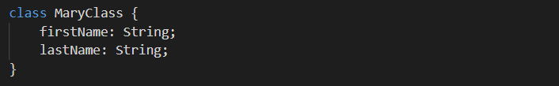
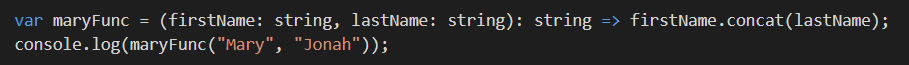

## TypeScript

1. **I can create a Class**
 
    

    Above is a class named _MaryClass_.  
    It has _2 properties_ with their types (both are Strings) defined.  

2. **I can create an Interface**

      

    In the first block, the interface _IntFMary_ is created.  
    Any variable that will hold a type of IntFMary **must** provide concrete values for all the 3 properties and single method in the interface.  
    
    The second block creates a variable maryObj and has provided the appropraite details.  

3. **I can declare a function with type annotations**  

      

    The code above creates the variable _maryFunc_ whose contents are an arrow function.  
    This function requires 2 arguments: _first and last name_ and it returns the full name without spacing.

4. **I know which array methods mutate data and which ones don’t**

    | Mutate Data        | Does not mutate data  |   |
    | :---:    | :-:     | :-: |
    | concat() | every() |  |
    |          |         |  |

